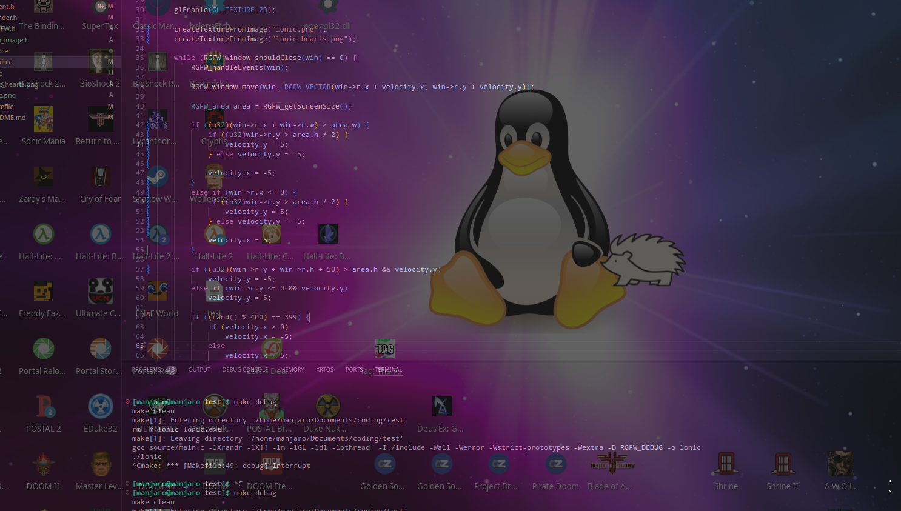

# Lonic Desktop Pet
A virtual pet using the RSGL mascot, Lonic. Made using RGFW, stb_image and OpenGL ~1.1

# building
to build the program simply run `make`, this will create the lonic executable 

you must run this executable in the same directory as the lonic images

# features
- lonic moves around on screen
- 